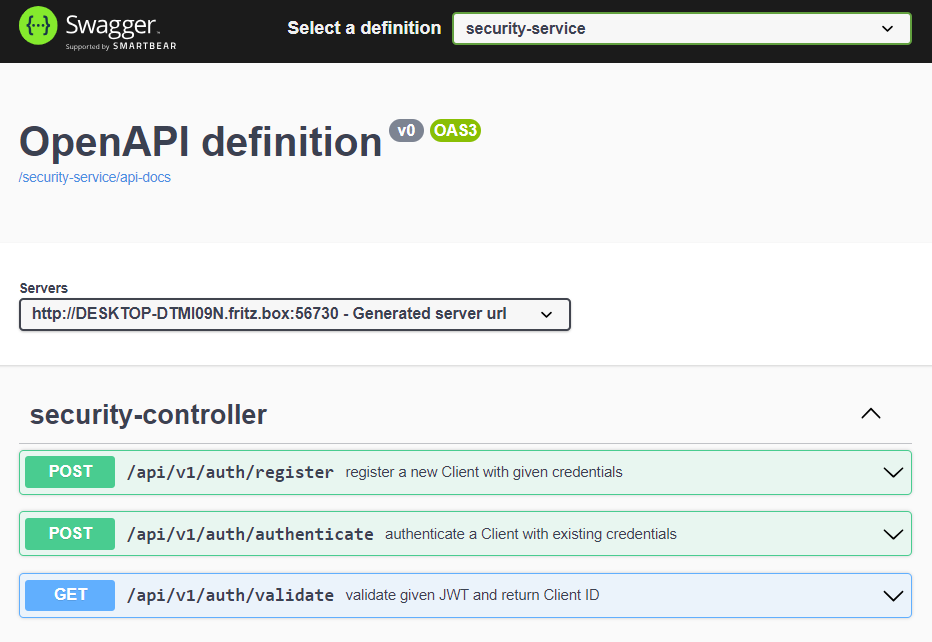
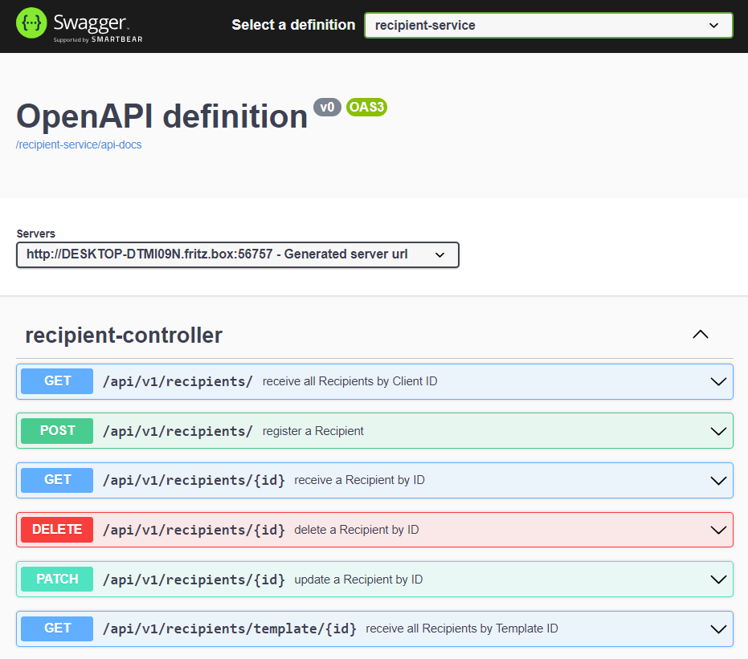
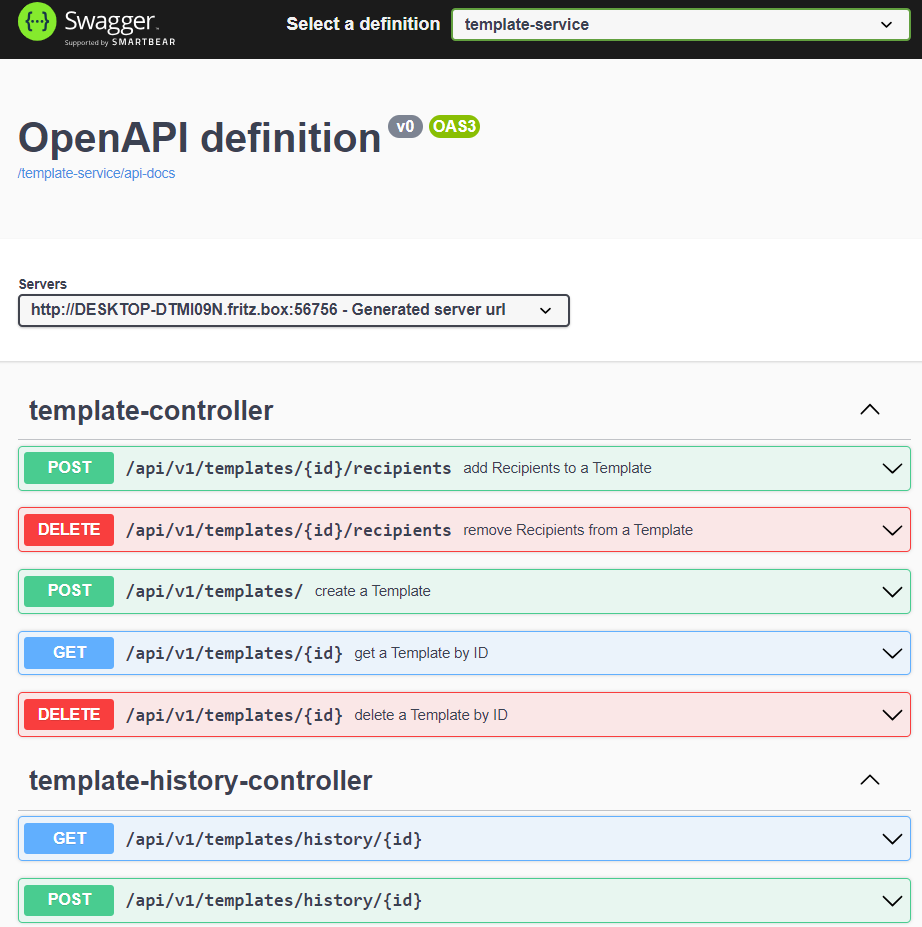
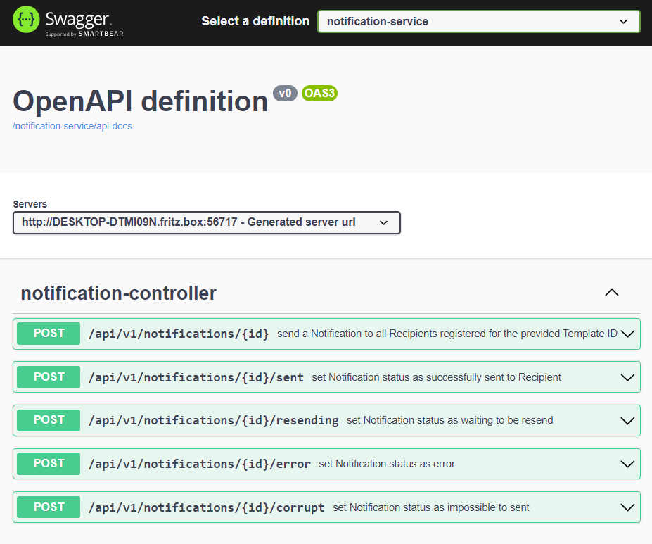
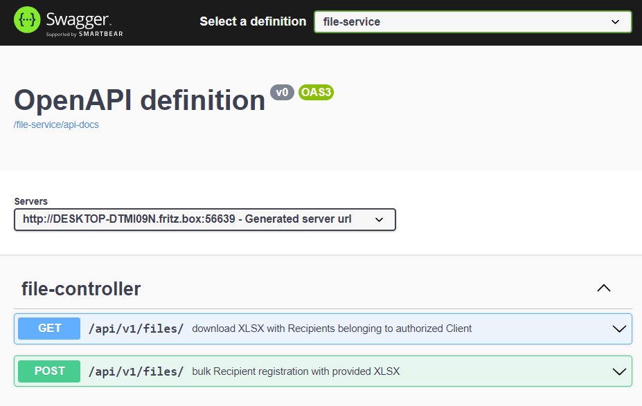
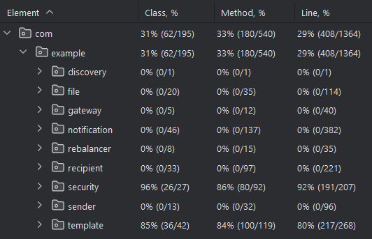

<div align="center">

# ⚡ Rapid Alert Platform

**A cloud-native, event-driven microservices platform for delivering real-time mass notifications at scale.**

[](https://openjdk.org/projects/jdk/17/)
[](https://spring.io/projects/spring-boot)
[](https://kafka.apache.org/)
[](https://www.postgresql.org/)
[](https://docs.docker.com/compose/)
[](LICENSE)

<br/>

> Rapid Alert Platform enables organizations to broadcast targeted notifications to millions of recipients simultaneously — across Telegram, email, and SMS — with built-in reliability, JWT-secured access, and horizontal scalability via Apache Kafka.

[Getting Started](#-getting-started) · [Architecture](#-architecture) · [Services](#-services) · [API Docs](#-api-documentation) · [Contributing](#-contributing)

</div>

---

## 📌 Overview

Rapid Alert Platform is a production-ready distributed system built with the microservices pattern. It was designed to solve a single hard problem: **how do you reliably notify a massive number of people, fast, without losing a single message?**

The answer is a pipeline of independently deployable services, each with a clear responsibility, communicating asynchronously via Apache Kafka. Whether you're alerting 100 users or 10,000,000 — the platform scales horizontally by spinning up additional service instances, which are automatically discovered and load-balanced via Eureka.

---

## ✨ Key Features

| Feature | Status | Details |
|---|:---:|---|
| 📨 **Telegram Notifications** | ✅ Live | Real-time dispatch via Telegram Bot API |
| 📧 **Email Notifications** | 🔧 Planned | SMTP integration in progress |
| 📱 **Push Notifications** | 🔧 Planned | Firebase FCM support |
| 📩 **SMS Alerts** | 🔧 Planned | Twilio integration |
| 📂 **Bulk Recipient Import** | ✅ Live | Upload `.xlsx` to register thousands of recipients instantly |
| 🗒️ **Notification Templates** | ✅ Live | Create reusable templates for instant alerting |
| 🔁 **Automatic Retry** | ✅ Live | Failed messages auto-requeued via Rebalancer service |
| 📍 **Geolocation Targeting** | 🔧 Planned | Filter recipients by geographic region |
| 🔐 **JWT Authentication** | ✅ Live | Stateless auth enforced at the API Gateway layer |
| 🔗 **URL Shortening** | ✅ Live | Embedded links auto-shortened in notification messages |
| 📊 **Notification History** | ✅ Live | Full audit trail per recipient and template |

---

## 🏗️ Architecture

The platform follows an **event-driven microservices architecture** orchestrated through Apache Kafka. Every service is independently deployable and registered with the Eureka Discovery Server for dynamic routing.

```
Client → API Gateway → [JWT Validation via Security Service]
                     ↓
           Recipient Service ──(Kafka)──▶ Notification Service
                                                   │
                              ┌────────────────────┤
                              ▼                    ▼
                         Sender Service      Rebalancer Service
                         (Telegram API)     (RESENDING recovery)
```


### How Scalability Works

When a notification request comes in with 1,000,000 recipient IDs:

1. **Partition** — The Recipient Service queries Eureka to find how many instances are running (say, 100). It splits the recipient list into 100 equal batches of 10,000.
2. **Distribute** — Each batch is published to Kafka, and each running instance picks up one batch in parallel.
3. **Deliver** — The Notification Service dispatches messages concurrently to the Sender Service.
4. **Recover** — Any failed deliveries are flagged as `RESENDING`. The Rebalancer periodically sweeps these and re-publishes them, guaranteeing at-least-once delivery.

---

## 🧩 Services

| Service | Port | Description |
|---|:---:|---|
| `api-gateway` | `8080` | Central entry point. Routes requests, enforces JWT auth, aggregates Swagger UI |
| `discovery-server` | `8761` | Eureka service registry for dynamic service discovery |
| `security-service` | — | Issues and validates JWT tokens; manages client credentials |
| `recipient-service` | — | CRUD for recipients; Kafka-based bulk processing and partitioning |
| `template-service` | — | Manages reusable notification templates; CDC via Debezium |
| `notification-service` | — | Core orchestration; tracks delivery state machine per notification |
| `sender` | — | Dispatches Telegram messages; marks failures as `RESENDING` |
| `rebalancer` | — | Scheduled job that recovers and re-queues stuck `RESENDING` notifications |
| `file-service` | — | Parses `.xlsx` uploads and registers recipients in bulk |
| `url-shortener` | — | Shortens embedded URLs in notification payloads |
| `telegram-bot-server` | — | Interactive Telegram bot for recipient responses |

---

## 🛠️ Tech Stack

| Layer | Technology |
|---|---|
| **Language** | Java 17 |
| **Framework** | Spring Boot 3.1, Spring Cloud 2022.0.3 |
| **API Gateway** | Spring Cloud Gateway |
| **Service Discovery** | Netflix Eureka |
| **Messaging** | Apache Kafka (Confluent 7.3.2) |
| **Databases** | PostgreSQL (per-service isolation) |
| **Auth** | JWT (JJWT), Spring Security |
| **API Docs** | SpringDoc OpenAPI / Swagger UI |
| **Mapping** | MapStruct |
| **Boilerplate** | Lombok |
| **Testing** | JUnit 5, Testcontainers, AssertJ |
| **Containerization** | Docker, Docker Compose |

---

## 🚀 Getting Started

### Prerequisites

Make sure you have the following installed:

- [Docker Desktop](https://www.docker.com/products/docker-desktop/) (v20+)
- [Docker Compose](https://docs.docker.com/compose/) (v3.8+)
- Java 17+ (for local development)

### Run with Docker Compose

The easiest way to run the full platform locally:

```bash
# 1. Clone the repository
git clone https://github.com/Kadivendi/rapid-alert-platform.git
cd rapid-alert-platform

# 2. Start all services
docker compose up -d

# 3. Check all services are healthy
docker compose ps
```

Once running, the **API Gateway** will be available at:

```
http://localhost:8080
```

### Verify Setup

| Service | URL |
|---|---|
| Swagger UI (all endpoints) | http://localhost:8080/webjars/swagger-ui/index.html |
| Eureka Dashboard | http://localhost:8761 |

---

## 📡 API Documentation

All API endpoints are documented and accessible through the **centralized Swagger UI** served by the API Gateway — no need to check individual services.

```
http://localhost:8080/webjars/swagger-ui/index.html
```

### Available Endpoint Groups

<details>
<summary><strong>🔐 Security — Authentication & Token Management</strong></summary>



</details>

<details>
<summary><strong>👥 Recipients — Register, Update & Manage Recipients</strong></summary>



</details>

<details>
<summary><strong>📋 Templates — Create & Manage Notification Templates</strong></summary>



</details>

<details>
<summary><strong>🔔 Notifications — Send & Track Notifications</strong></summary>



</details>

<details>
<summary><strong>📁 Files — Bulk Recipient Import via XLSX</strong></summary>



</details>

---

## 🔐 Security Model

Every request must carry a valid **JWT Bearer token** issued by the Security Service. Here's how it flows:

```
1. Client  →  POST /security/login  →  Security Service
2. Security Service returns a signed JWT
3. Client  →  ANY request + Authorization: Bearer <token>  →  API Gateway
4. API Gateway extracts + validates JWT with Security Service
5. On success, client ID is injected as a request header
6. Downstream service reads the client ID header for request scoping
```

No downstream service ever validates tokens directly — **all auth is centralized at the gateway**.

---

## 📊 Test Coverage

Current unit + integration test coverage: **29%**



Integration tests use **Testcontainers** to spin up real PostgreSQL and Kafka instances, ensuring tests reflect production behavior.

---

## 🤝 Contributing

Contributions are welcome! Here's how to get started:

```bash
# Fork the repo, then:
git checkout -b feat/your-feature-name
# Make your changes
git commit -m "feat(scope): describe your change"
git push origin feat/your-feature-name
# Open a Pull Request
```

Please follow [Conventional Commits](https://www.conventionalcommits.org/) for commit messages.

---

## 📄 License

This project is licensed under the **MIT License**. See [LICENSE](LICENSE) for details.

---

<div align="center">
  <sub>Built with ☕ and Apache Kafka. Distributed systems are hard — this makes them a little easier.</sub>
</div>
